# Estimación del MIC mediante métodos de clasificación ordinal
## Modelos

Tradicionalmente, en el área de machine learning (ML), las alternativas de modelación para clasificación ordinal se pueden resumir en 3 enfoques generales: enfoques ingénuos, descomposiciones binarias y métodos de umbralización. Esto se ilustra en la siguiente Figura<a href="#note3" id="note3ref">3</a> .

<figure>
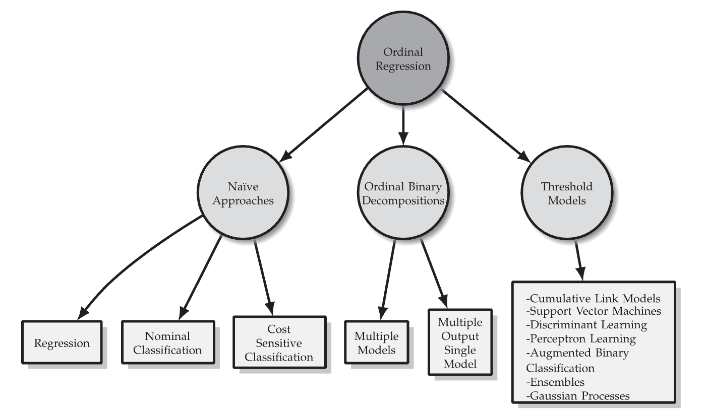
<figcaption> Taxonomía de métodos de clasificación ordinal. </figcaption>
</figure>

Los métodos que usamos pertenecen al segundo y tercer grupo.
Se implementaron dos modelos principales, uno de ellos basado en resolver varios problemas binarios con recodificaciones de la variable de respuesta $\mathbf{y}$ apropiadas y uno basado en la adaptación de una red neuronal.

Consideraremos un conjunto de datos $(\mathbf{X},\mathbf{y})$, donde $\mathbf{X}\in\mathbb{R}^d$ es la matriz de características con $n$ observaciones (renglones) y $\mathbf{y}\in \lbrace 1,2,\ldots,K \rbrace$, la correspondiente variable de respuesta con $K$ categorías ordinales.

### Modelos múltiples

Éste grupo de modelos se basan en un dos pasos simples<a href="#note1" id="note1ref">1</a>

1. Recodificación de la variable de respuesta ordinal en múltiples variables de respuesta binaria que preserven la estructura ordinal multiclase (Figura 1).
<figure>
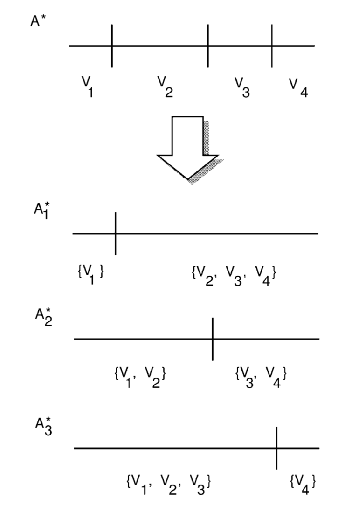
<figcaption> Figura 1. Transformación de una variable ordinal con 4 valores en 3 variables binarias. </figcaption>
</figure>

2. Construcción de conjuntos de datos para la formulación de $K-1$ problemas binarios de clasificación (Figura 2).
<figure>
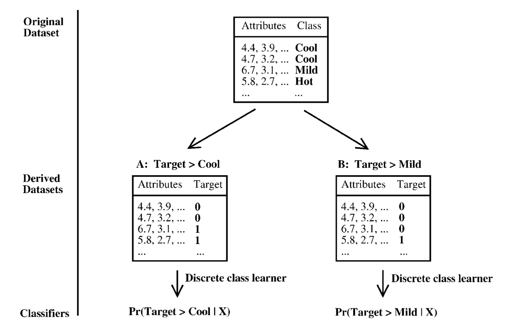
<figcaption> Figura 2. Creación de los datasets para múltiples problemas de clasificación binaria. </figcaption>
</figure>

3. Predicción de la categoría ordinal en la fase de prueba (para datos nuevos) según el siguiente esquema (Figura 3):

$$
\begin{align}
P(y_1) & = 1-P(\text{Target}>y_1) \nonumber \\
P(y_i) & = P(\text{Target}>y_{i-1})\times(1-P(\text{Target}>y_i)), 1<i<K  \nonumber \\
P(y_K) & = 1-P(\text{Target}>y_{K-1}) \nonumber
\end{align}
$$

<figure>
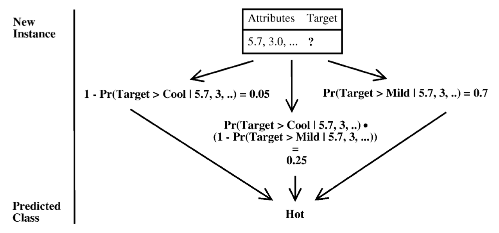
<figcaption> Figura 3. Predicción de la categoria ordinal de un dato nuevo basado en múltiples problemas binarios. </figcaption>
</figure>

Este esquema permite el uso de diferentes métodos de clasificación en el paso 1 sin tener que realizar ninguna modificación particular, el único requisito es que el algoritmo sea capaz de estimar probabilidades de asignación para cada categoría binaria.

### Redes neuronales (NN) para clasificación ordinal

En éste método, se realiza una codificación particular de la variable de respuesta para estimar una distribución de probabilidad que refleje la naturaleza ordinal del vector de respuesta $\mathbf{y}$.

En un problema de clasificación estándar, una NN se entrena para obtener una distribución de probabilidad $P(y_i=k|\mathbf{x}_i)$, para $k=1,\ldots, K$, $i=1,\ldots,n$, sobre los valores codificados de $y_i$ mediante un vector *one-hot*, es decir, si $y_i=k$, el encoding correspondiente es $t_i=(0,\ldots,0,1_k,0,\ldots,0)$ y la salida de la NN es $O_i=(o_1,o_2,\ldots,o_k,\ldots,o_K)$, donde $o_k$ debe ser muy cercano a 1 y las demás entradas deben ser muy cercanas a 0, con la restricción $\sum_{j=1}^K o_j=1$. 
En la propuesta de Cheng et al.<a href="#note2" id="note2ref">2</a>, el orden en las categorías se impone considerando que, si una observación pertenece a la categoría $k$, también se le asignan las $1,\ldots k-1$ categorías inferiores. Entonces, si $y_i=k$, el encoding correspondiente es $t_i=(1,\ldots,1,1_k,0,\ldots,0)$ y el objetivo de la NN es obtener un vector de salida $O_i=(o_1,o_2,\ldots,o_k,\ldots,o_K)$, donde $o_j$ $(j \leq k)$ debe ser muy cercano a 1 y $o_j$ $(j > k)$ deben ser muy cercanas a 0, y la restricción se modifica como $\sum_{j=1}^K o_j=k$, es decir, la estimación del número de categorías a las cuáles pertenece $\mathbf{x}_i$.

A diferencia de las NN estándar, la capa de salida de las NN ordinal no usan la transformación softmax en la capa de salida, sino solo la función sigmoide $\frac{1}{1+e^{-z_j}}$, donde $z_j$ es el input que procesa el nodo de salida $O_j$, que es usado para estimar la probabilidad $o_j=P(y_i=j|\mathbf{x}_i)$, de forma independiente, sin la normalización usada en las NN estándar. La Figura 4 ilustra las diferencias entre ambos modelos.

<figure>
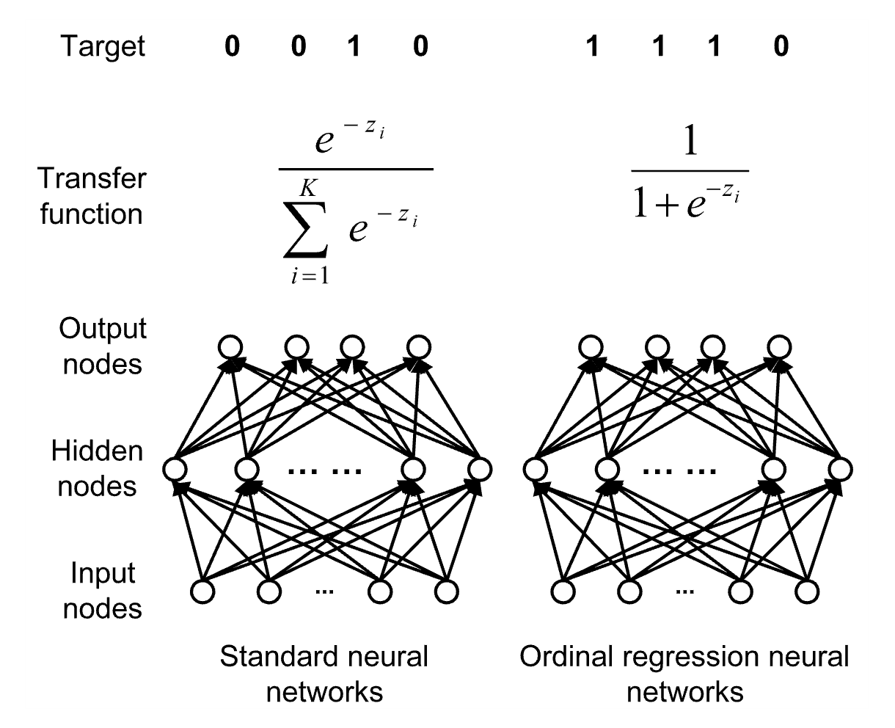
<figcaption> Figura 4. Comparación entre una NN estándar y la NN ordinal. </figcaption>
</figure>

## Metodología

Para cada base de datos (Meropenem y Ciprofloxacin), se implementaron dos pipelines basados en AMR count mostrados en las Figuras 5 y 6.

<figure>
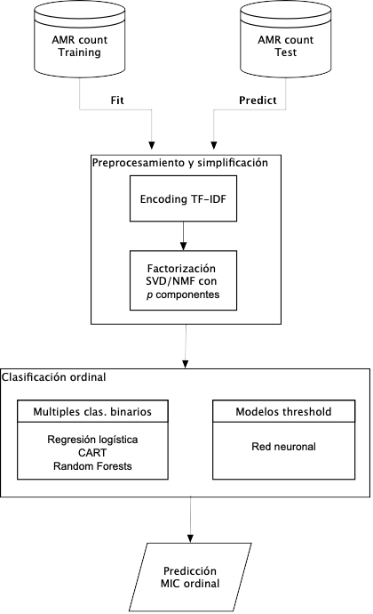
<figcaption> Figura 5. Pipeline 1. </figcaption>
</figure>

<figure>
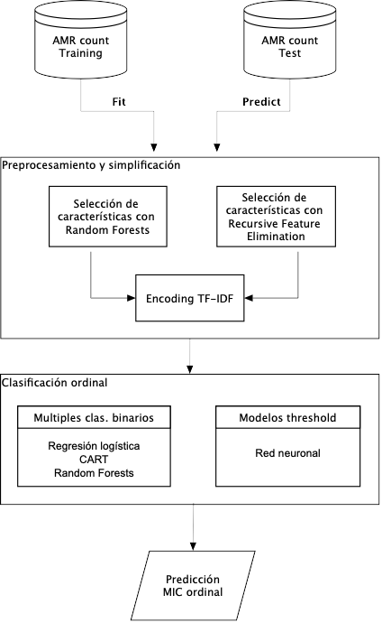
<figcaption> Figura 6. Pipeline 2. </figcaption>
</figure>

En el pipeline 1 se usa una factorización SVD truncada y una factorización no-negativa de matrices con $p=100$ componentes principales en ambos. Posteriormente se usa un encoding TF-IDF, principalmente usado en el área de procesamiento de lenguaje natural, pero adaptable fácilmente a matrices de conteos de genes como nuestro caso.

Para el pipeline 2, se realiza una selección de $p=100$ variables importantes usando Randomm Forests (RF) con la función de Gini como medida de impureza. También se usó el método de recursive feature elimination (RFE) usando un clasificador de máquinas de soporte vectorial (SVM) con un kernel lineal como clasificador base.

Para los clasificadores ordinales basados en múltiples clasificadores binarios, se realizó una búsqueda de parámetros óptimos con Grid Search y validación cruzada. En el caso de la red neuronal ordinal, se utilizó la arquitectura que se muestra en la Figura 7.
<figure>
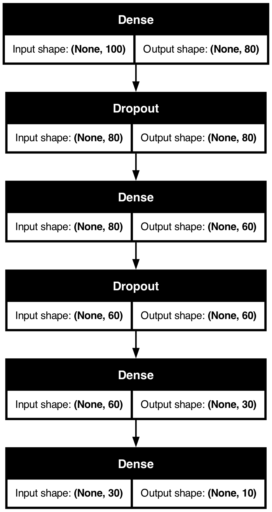
<figcaption> Figura 7. Red neuronal para clasificación ordinal. </figcaption>
</figure>

Las métricas de desempeño usadas fueron mean absolute error (MAE) y root mean squares error (RMSE), definidas como
$$
\begin{align}
MAE & = \frac{1}{n} \sum_{i=1}^n |y_i-\hat{y}_i|\nonumber \\
RMSE & = \sqrt{\frac{1}{n} \sum_{i=1}^n (y_i-\hat{y}_i)^2} \nonumber
\end{align}
$$

Como baselines, se usó una regresión lineal múltiple (MLR) y un árbol de regresión (DTR).

## Resultados

###  Meropenem Loose, Pipeline 1
Ver `mic_ordinal_meropenem_loose.ipynb`

#### Análisis exploratorio
FALTA

#### Estimación del MIC

<table>
 <thead>
  <tr>
   <th style="text-align:left;"> Método </th>
   <th style="text-align:right;"> MAE (50 folds-CV) </th>
   <th style="text-align:right;"> RMSE (50 folds-CV) </th>
   <th style="text-align:right;"> MAE (test) </th>
   <th style="text-align:right;"> RMSE (test) </th>
  </tr>
 </thead>
<tbody>
  <tr>
   <td style="text-align:left;"> MLR (baseline) </td>
   <td style="text-align:right;">  </td>
   <td style="text-align:right;">  </td>
   <td style="text-align:right;"> 3.223 </td>
   <td style="text-align:right;"> 5.222 </td>
  </tr>  
  <tr>
   <td style="text-align:left;"> DTR (baseline) </td>
   <td style="text-align:right;">  </td>
   <td style="text-align:right;">  </td>
   <td style="text-align:right;"> 2.940 </td>
   <td style="text-align:right;"> 6.486 </td>
  </tr> 
  <tr>
   <td style="text-align:left;"> Ordinal-LR </td>
   <td style="text-align:right;"> 1.237 +/- 0.101 </td>
   <td style="text-align:right;"> 2.352 +/- 0.102 </td>
   <td style="text-align:right;"> 1.386  </td>
   <td style="text-align:right;"> 2.569 </td>
  </tr> 
  <tr>
   <td style="text-align:left;"> Ordinal-CART </td>
   <td style="text-align:right;"> 1.472 +/- 0.072 </td>
   <td style="text-align:right;"> 2.412 +/- 0.111 </td>
   <td style="text-align:right;"> 1.474 </td>
   <td style="text-align:right;"> 2.405 </td>
  </tr> 
  <tr>
   <td style="text-align:left;"> Ordinal-RF </td>
   <td style="text-align:right;"> 1.111 +/- 0.075 </td>
   <td style="text-align:right;"> 2.263 +/- 0.108 </td>
   <td style="text-align:right;"> 1.193 </td>
   <td style="text-align:right;"> 2.420 </td>
  </tr> 
  <tr>
   <td style="text-align:left;"> Ordinal-NN </td>
   <td style="text-align:right;"> 0.611 +/- 0.098 </td>
   <td style="text-align:right;"> 1.437 +/- 0.176 </td>
   <td style="text-align:right;"> 1.064 </td>
   <td style="text-align:right;"> 2.063 </td>
  </tr> 
  <tr>
   <td style="text-align:left;"> LR estándar </td>
   <td style="text-align:right;">  </td>
   <td style="text-align:right;">  </td>
   <td style="text-align:right;">  </td>
   <td style="text-align:right;">  </td>
  </tr> 
  <tr>
   <td style="text-align:left;"> CART estándar </td>
   <td style="text-align:right;">  </td>
   <td style="text-align:right;">  </td>
   <td style="text-align:right;">  </td>
   <td style="text-align:right;">  </td>
  </tr>
  <tr>
   <td style="text-align:left;"> RF estándar </td>
   <td style="text-align:right;">  </td>
   <td style="text-align:right;">  </td>
   <td style="text-align:right;">  </td>
   <td style="text-align:right;">  </td>
  </tr>
  <tr>
   <td style="text-align:left;"> NN estándar </td>
   <td style="text-align:right;">  </td>
   <td style="text-align:right;">  </td>
   <td style="text-align:right;">  </td>
   <td style="text-align:right;">  </td>
  </tr> 
</tbody>
</table>

Como referencia, se muestran las métricas usuales de clasificación para cada algoritmo ordinal. Es necesario recalcar que éstas métricas no son las más adecuadas cuando la respuesta es ordinal.

- Ordinal LR:

             precision    recall  f1-score   support

           0       0.00      0.00      0.00         7
           1       0.58      0.14      0.22        51
           2       0.57      0.70      0.63        84
           3       0.09      0.07      0.08        15
           4       0.67      0.86      0.75       221
           5       0.52      0.38      0.44        34
           6       0.29      0.13      0.18        15
           7       0.40      0.35      0.38        17
           8       0.60      0.12      0.21        24
           9       0.60      0.63      0.62       159

    accuracy                           0.61       627
   macro avg       0.43      0.34      0.35       627
weighted avg       0.58      0.61      0.57       627

<figure>
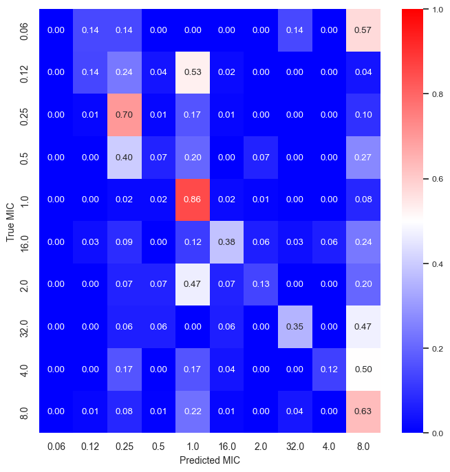
<figcaption> Regresión logística ordinal. Datos de test. </figcaption>
</figure>

- Ordinal CART
              
                precision    recall  f1-score   support

            0       0.00      0.00      0.00         7
            1       0.44      0.08      0.13        51
            2       0.59      0.48      0.53        84
            3       0.06      0.13      0.08        15
            4       0.60      0.76      0.67       221
            5       0.25      0.47      0.32        34
            6       0.06      0.07      0.06        15
            7       0.18      0.29      0.22        17
            8       0.12      0.12      0.12        24
            9       0.71      0.45      0.55       159

      accuracy                           0.49       627
      macro avg      0.30      0.29      0.27       627
      weighted avg   0.53      0.49      0.49       627

<figure>
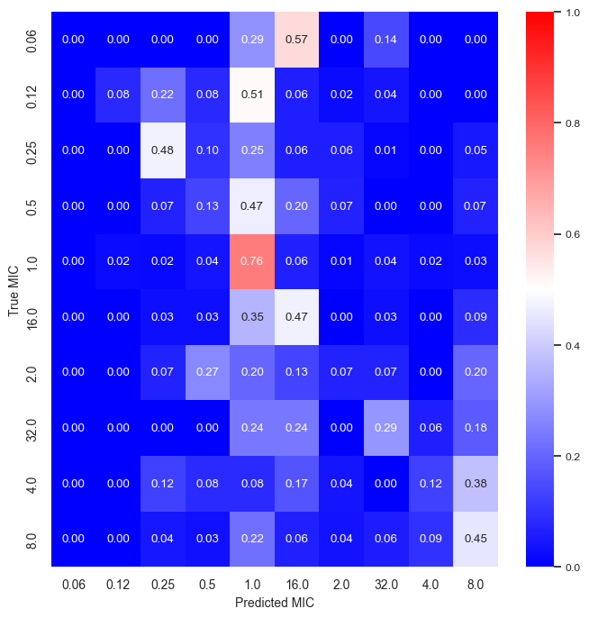
<figcaption> CART ordinal. Datos de test. </figcaption>
</figure>

- Random Forests ordinal

                    precision    recall  f1-score   support

                0       0.00      0.00      0.00         7
                1       0.59      0.31      0.41        51
                2       0.61      0.74      0.67        84
                3       0.13      0.13      0.13        15
                4       0.74      0.87      0.80       221
                5       0.76      0.47      0.58        34
                6       0.25      0.13      0.17        15
                7       0.67      0.59      0.62        17
                8       0.57      0.17      0.26        24
                9       0.68      0.71      0.70       159

      accuracy                              0.67       627
      macro avg         0.50      0.41      0.43       627
      weighted avg      0.65      0.67      0.65       627

<figure>
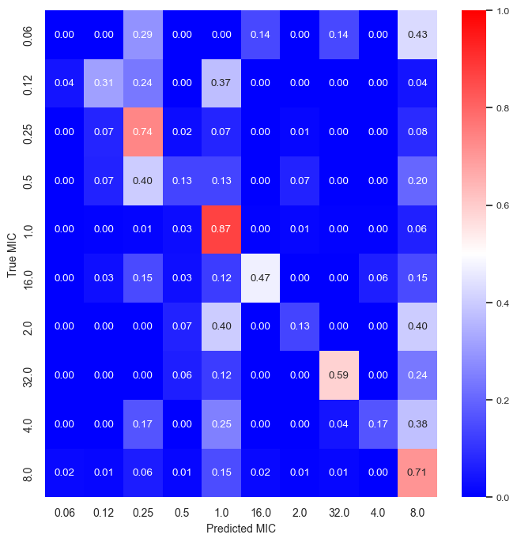
<figcaption> CART ordinal. Datos de test. </figcaption>
</figure>

- Red neuronal ordinal

                    precision    recall  f1-score   support

                0       0.00      0.00      0.00         7
                1       1.00      0.04      0.08        51
                2       0.52      0.71      0.60        84
                3       0.05      0.07      0.05        15
                4       0.75      0.82      0.79       221
                5       0.38      0.53      0.44        34
                6       0.10      0.13      0.11        15
                7       0.23      0.18      0.20        17
                8       0.00      0.00      0.00        24
                9       0.74      0.75      0.74       159

        accuracy                            0.62       627
        macro avg       0.38      0.32      0.30       627
        weighted avg    0.63      0.62      0.59       627

<figure>
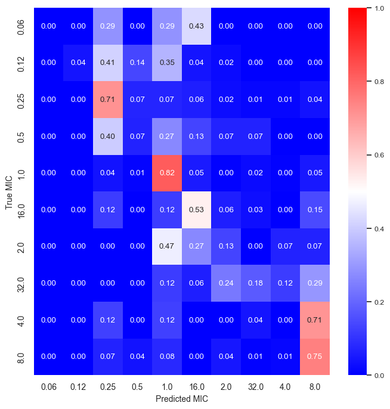
<figcaption> CART ordinal. Datos de test. </figcaption>
</figure>

###  Meropenem Loose, Pipeline 2:

Ver `mic_ordinal_meropenem_loose_selec_var.ipynb`

#### Análisis exploratorio
FALTA

#### Estimación del MIC
FALTA

###  Meropenem Strict, Pipeline 1:

#### Análisis exploratorio
FALTA

#### Estimación del MIC
FALTA

###  Meropenem Strict, Pipeline 2:

#### Análisis exploratorio
FALTA

#### Estimación del MIC
FALTA

###  Ciprofloxacin Loose, Pipeline 1:

#### Análisis exploratorio
FALTA

#### Estimación del MIC
FALTA

###  Ciprofoxacin Loose, Pipeline 2:

#### Análisis exploratorio
FALTA

#### Estimación del MIC
FALTA

###  Ciprofoxacin Strict, Pipeline 1:

#### Análisis exploratorio
FALTA

#### Estimación del MIC
FALTA

###  Ciprofoxacin Strict, Pipeline 2:

#### Análisis exploratorio
FALTA

#### Estimación del MIC
FALTA

# Referencias

<a id="note1" href="#note1ref">1</a>Frank, E., Hall, M. (2001). A Simple Approach to Ordinal Classification. In: De Raedt, L., Flach, P. (eds) Machine Learning: ECML 2001. ECML 2001. Lecture Notes in Computer Science(), vol 2167. Springer, Berlin, Heidelberg. https://doi.org/10.1007/3-540-44795-4_13

<a id="note2" href="#note2ref">2</a>Jianlin Cheng, Zheng Wang and G. Pollastri, "A neural network approach to ordinal regression," 2008 IEEE International Joint Conference on Neural Networks (IEEE World Congress on Computational Intelligence), Hong Kong, 2008, pp. 1279-1284, doi: 10.1109/IJCNN.2008.4633963.

<a id="note3" href="#note3ref">3</a>
P. A. Gutiérrez, M. Pérez-Ortiz, J. Sánchez-Monedero, F. Fernández-Navarro and C. Hervás-Martínez, "Ordinal Regression Methods: Survey and Experimental Study," in IEEE Transactions on Knowledge and Data Engineering, vol. 28, no. 1, pp. 127-146, 1 Jan. 2016, doi: 10.1109/TKDE.2015.2457911.
